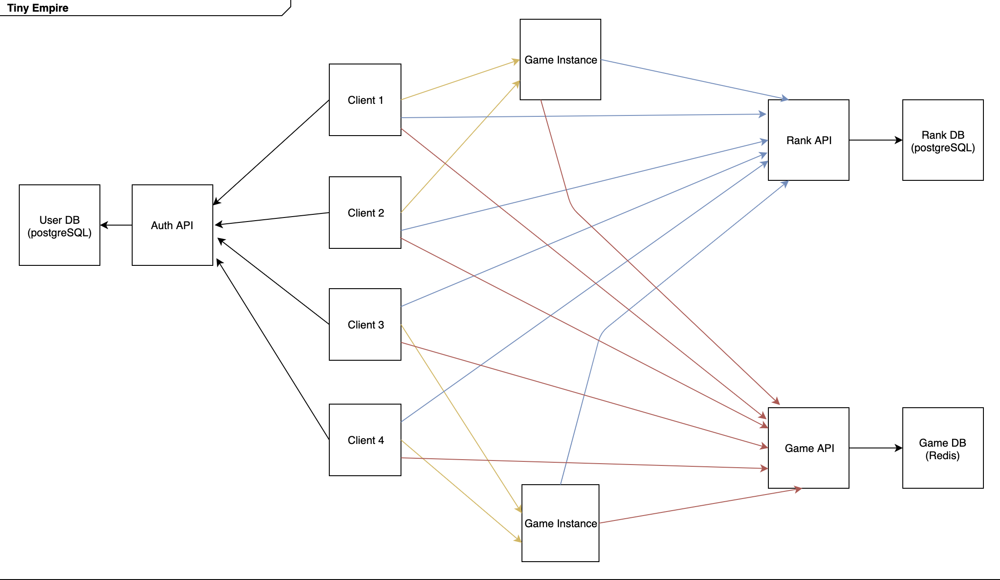
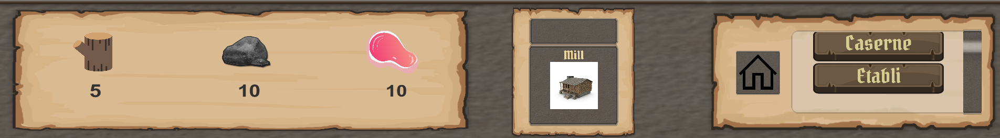

---
header-includes:
  - '`\usepackage{graphicx}`{=latex}'
---

\begin{titlepage}

\newcommand{\HRule}{\rule{\linewidth}{0.5mm}}

\center

\textsc{\LARGE Université de Strasbourg}\\[1cm]
\textsc{\Large Cursus Master Ingénierie – Informatique}\\[0.5cm]
\textsc{\large L3S6}\\[0.5cm]

\HRule \\[0.4cm]
{ \huge \bfseries rapport projet intégrateur}\\[0.4cm]
\HRule \\[1.5cm]

\begin{minipage}[t]{0.4\textwidth}
\begin{flushleft} \large
\emph{Auteur :}\\
Timothée \textsc{Oliger}\\
Adrien \textsc{Ossywa}\\
\end{flushleft}
\end{minipage}
~
\begin{minipage}[t]{0.4\textwidth}
\begin{flushright} \large
\emph{Responsable :} \\
Stephane \textsc{Cateloin}
\end{flushright}
\end{minipage}\\[1cm]

\textsc{Sujet}\\
\emph{Tiny Empire}\\[1.5cm]

\begin{minipage}{.4\textwidth}
\begin{flushleft}
\includegraphics[width=.8\linewidth]{images/unistra.png}
\end{flushleft}
\end{minipage}
~
\begin{minipage}{.4\textwidth}
\begin{flushright}
\includegraphics[width=.8\linewidth]{images/reseaux.jpg}
\end{flushright}
\end{minipage}\\[1cm]

{\large \today}

\vfill

\end{titlepage}

\tableofcontents

# Introduction

Ce projet nous permet d'appliquer les compétences que nous avons acquises durant notre licence, dans les différents domaines étudiés, notamment l'image et le réseau en CMI.
Il s'agit de créer un jeu multijoueur en temps réel, reprenant un jeux des années 1980-1990.

# Contexte

Les CMI en option Imagerie ont été amenés à utiliser un moteur de jeu 3D, ici Unity, lors d'un projet au semestre 5.
Cette matière a permis d'approcer l'utilisation de scripts et la manipulation de l'interface de Unity. Ces connaissance préalables ont permis d'aborder plus rapidement la conception du jeu, ainsi de connaître la solutions à certains problèmes auxquels ils auraient pu faire face auparavant.
En choisissant d'utiliser Unity plutôt qu'un moteur de jeu inconnu des CMI Image du groupe, il a été posible d'avancer plus vite dans l'ensemble de la conception du jeu.

# Choix du jeu

Un premier brainstorming a été réalisé lors des réunions de début, afin de trouver le jeu le plus adapté aux demandes et contraintes du sujet.
Les avis se sont majoritairement dirigés vers un Real Time Strategy (RTS) game, soit un jeu de stratégie en temps réel.
Après reflexion, nous avons fini par choisir Age Of Empire, car cela motivait tous les membres de l'équipe, et qu'une version alégée nous paraissait accessible.
Cependant nous avons sous-estimé la charge de travail que représente un RTS tel que Age Of Empire. De ce fait nous avons du limiter énormément les fonctionnalités et nous avons
fait impasse sur la version mobile et Web.

# Conception du jeu

Plusieurs réunions de groupes ont été organisées surtout au début du semestre, afin de se décider sur les technologies à utiliser et l'arcitecture du projet à venir.
Nous avons réalisé des schémas pour prévoir au mieux une architecture robuste et cohérente avec le jeu Age Of Empire original.

## Technologies

Un des premiers problèmes rencontrés a été l'hétérogénéité entre les compétences techniques des différents membres du groupe.
Nous avons du faire des compromis pour que tous le monde puisse progresser dans de bonne conditions, et que les peronnes avançant plus rapidement puisse opérer sur un nombre plus important de tâches.

### Langage de programmation

Pour l'instance de jeu, nous avons hésité entre JAVA, Python et GO.
JAVA étant lourd et en voie d'extinction, Pyhton et GO étaient les deux choix restants.
Après discussion GO nous a paru plus adapté, dans le sens où il ressemble fortement au C et possède les avantages suivant:

- d'être compilable
- d'intégrer des outils de test
- d'intégrer une gestion des dépendances
- d'intégrer une documentation
- de très bien s'intégrer à une architecture micro-service

## Architecture

En discutant entre membres de l'équipe, nous nous sommes tournés vers une achitecture de type "micro-services" : c'est celle qui nous a semblée la plus propie à l'application des connaissances respectives de chacun.

## Comunication en temps réel avec GRPC

Pour la communication temps réel entre le client et l'instance de jeux nous devons utiliser quelquechose de solide qui permet de jouer en temps réel.
La deuxième contrainte et d'utiliser un protocol qui s'adapte à un environement cloud sans ajouter une quantité non négligeable de code.

Cette librairie permet d'établir une communication stable reposant sur les standards HTTP/2.
Cette technologie a été retenu car elle peut être utilisée pour plusieurs langage de développement et est facilement intégrable au code source.
Plusieurs services peuvent être implémentés et générer dans le langage cible voulu à partir d'un fichier .proto.
Ces services doivent être décrites dans ce fichier pour être ensuite interprétés par le compilateur protoc.
Un code va être généré à l'aide de ce fichier contenant l'équivalence des services spécifiées écrits en langage cible.
Ainsi, les fonctions/classes crées permettent de récupérer/envoyer des informations de manière transparente lors du dévelopement du jeu.
Le fichier .proto doit être le même pour code grpc go et grpc C#. Ainsi les services doivent êtres formalisé de manière générique pour les 2 langages.
Les modifications de ce fichier implique qu'une nouvelle compilation des fichiers GRPC dans tous les langages cibles du projet doit être réalisé.

Dans le dossier utilisé pour Unity, il faut insérer dans le dossier "Assets/Plugin" les éléments du Framework GRPC qui va permettre d'intérpreter les services écrits langage cible
issus du fichier .proto

### Micro-services

Les avantages d'une architecture de type "micro-services" sont :

- l'indépendance entre les services
- la quantité de code raisonable et facilement assimilable contenue dans chaque service
- la possibilité d'augmenter la robustesse de l'application en dupliquant uniquement les services les plus solicités.

### API authentification

Nous avons décidé de choisir la réalistion d'une API GraphQL afin de se connecter/enregister et obtenir la liste des serveurs disponibles.

#### GraphQL

GraphQL est un language créé par Facebook.
Même si REST (Representational State Tranfer) demeure le format standart des API, certains développeurs décident de se tourner vers GraphQL pour combler leslacunes majeures de ce format.
Contrairement à REST, et son modèle relativement structuré basé sur les ressources, GraphQL intervient avec une approche plus flexible : on crée un schéma de requête, puis le serveur l'analyse et renvoie les informations demandées.
De plus, l'utilisation du projet "Apollo Server" permet de monter une API GraphQL très simplement et rapidement.

#### Knex / bookshelf

Nous avons choisi d'utiliser un Object-Relational Mapping (ORM) pour la base de données contenant les informations sur les partie et les joueurs.
Ce type de programme se place en interface entre un programme applicatif et une base de données relationnelle pour simuler une base de données orientée objet.
De manière imagée, un ORM peut être décrit comme une couche d'abstraction entre le "monde objet" et "monde relationnel".

### API de classement

Ce Service permet de calculer le niveaux de chaque joueur, il exploite pour cela les résulats des parties.

#### Ligues

Le système de classement classe les joueurs dans 4 ligues différentes. Le joueur commence dans la
ligue la plus basse, et lorsqu'il gagne des parties, il monte doucement le classement jusqu'à
terminer dans la ligue qu'il lui correpond

#### Avantages

L'avantage de ce système de classement et que le niveau de chaque partie correspond au niveau des joueurs.
Cela permet d'améliorer l'expérience de jeu grace à un système équilibré.

#### Avancement

A l'heure actuelle, nous l'avons pas pu l'implementer car c'est un module non necessaire au déroulement de la partie qui est la priorité.

### API de gestion des parties

Ce service permet de rejoindre des partie, obtenir des informations sur les parties comme la composition des équipes.

### Instance de partie

Les instances de partie sont écritent en GO et conteneuriser comme les autres services grace à docker.
Cela permetra à terme de générer une partie à la demande et de la supprimer facilement.

### Client

#### Moteur de jeu

Concernant le client, nous hésitions en Godot et unity.
Nous avons fait des tests durant 1 semaine pour pouvoir choisir le plus adapter.

##### Unity

Unity est un moteur de jeux propriétaire possédant un nombre conséquent d'assets et de fonctionnalités puissantes permetant de construire un jeux avec des outils performants.
L'avantage de Unity comparé à Godot, est que nous avon appris à le manipuler lors de l'UE "Moteur de Jeux 3D" ce qui a été décisif sur notre choix en plus du grand nombre d'utilisateurs.
A la vue de l'ampleur de notre projet, nous ne pouvions pas nous permettre de perdre un temps considérable sur la prise en main de Godot.

##### Godot

Godot est un moteur de jeux open source, il est léger et facilement intégrable avec git.
Cependant Godot souffre d'un manque cruel de communauté comparé à Unity et la documentation présentait des lacunes.
Pour départager un vote a été réalisé et notre choix s'est dirigé vers unity.

##### Choix final

Les personnes ayant testé Godot ont exprimés leurs réticences, elles étaient notament leurs expérience sur unity, la puissance d'unity et de sa grande librairie d'assets et le manque de motivation pour apprendre Godot.

# Organisation

Pour créer le jeux dans les meilleures conditions, il a fallu diviser le projet en plusieurs modules.
Pour rendre ce projet réalisable, nous avons décidé de rendre obligatoire l'utlisation du multijoueur.
Cette contrainte compliqua le dévelopement car il a fallu synchroniser le dévelopement du client et du serveur.
Cela dit, nous avons pu nous tourner vers un modèle de dévelopement itératif en intégrant au fur et à mesure les nouvelles features.

## Formations des équipes

La formation des équipes est venue naturellement en fonction des différents CMI **Image / Réseau**.
Nous avons essayé de rendre les équipes cohérentes, par exemple pour le noyaux, nous avons choisi d'y placer les membres les plus à l'aise avec la programmation système.

### Front

L'équipe front qui est composé des CMI Image est chargé de déveloper le client car ces derniers ont appris à utiliser Unity et sont plus à l'aise dans la création de l'UI / Animations ...
Elle est composée d'Adrien, Chloé et Marie.

### Noyaux

L'équipe noyaux est chargé de développer le noyau.
Jusqu'a l'alpha, elle était composée de Arthur, Louis C et de Dorian.
Durant la beta, le noyau ayant atteint ses objectifs, il est devenu plus judicieux de renforcer l'équipe réseaux en y transférant Louis C car il est à l'aise en C#.

### Réseaux

L'équipe réseaux est chargé de faire le lien entre le client et l'instance de la partie.
Elle est également en charge du dévelopement des API.
Louis T la composait à l'alpha avec le support de Tim, puis Louis Cesar le rejoigna pour booster le developement du client.
Le framework utilisé pour établir cette communication est "GRPC" entre l'instance de jeu et le client.

## Répartition des taches

La répartition des taches se fait grâce à gitlab, les issues sont créés et attribué ou choisi par les personnes disponibles.
Ce système permet de d'attribuer des taches correspondantes aux personnes augmentant ainsi la productivité.
les bugs bloquant le developement des features en cours de dévelopement sont misent en priorité.

### Gitlab

L'utilisation de gitlab est très agréable, contrairement à github, la version gratuite contient un large pannel de fonctionnabilités.

#### Issues

Les issues nous permettent de demander des features et de déclarer qu'on travail sur une feature.
Le gros problèmes que nous avons rencontré par rapport aux issues est qu'au début du projet certaines issues se faisaient sur le long thermes ou alors d'autres issues imprévues
auxquelles on avait pas pensé sont apparues au fil de l'avancement du projet.

#### Pull request

Lorsqu'une branche est stable, c'est à dire qu'elle passe les tests de l'intégration, une Pull request est créé.
Elle est validée après un test effectué par un membre et après avoir passé tout les test de l'intégration continu.

## Discussions

Les issues sont fort pratique, hélas pour des petites question technique il est utile d'utiliser de la communication sous forme de chat qui n'est pas le cas du système
de discussion directement intégré aux issues.

### Discord

Nous avons choisi discord comme logiciel de chat. En plus d'être gratuit il permet de faire des groupes d'utilisateurs et différents salons textuel et vocaux.

## CI / CD

Pour pouvoir garantir un maximum de stabilité, à chaque publication de commit, des scripts de test sont lancé sur des runner gitlab.

### gitlab CI

Gitlab permet grace au fichier .gitlab-ci.yaml de déclarer un pipeline qui peut tester, publier et deployer des solutions logiciels

### Webhook gitlab

Lorsqu'il y a un évenement sur un des projet git du groupe gitlab AOEINT, un message apparait dans le salon CI du discord, cela permet de prendre connaissance d'un commit ou d'une issue.

### mirroir github / docker cloud

L'instance gitlab de l'université de possède pas de registry docker.
Dockercloud perme
Dockercloud n'est pas compatible avec gitlab, pour pouvoir profiter de la ci il a falu faire un mirroir github.

# Developement

Le fait que tout le monde ne travaillait pas sous le même OS, le developpement à posé quelques soucis en début de projet.

## S'adapter aux configs

Il a falu faire du cas par cas afin d'installer go, unity et des dépendances sur chaques machines.

## Client

Le client est la seule partie avec laquelle l'utilisateur interagit.
Les objectif de ce module, et d'intéger un système d'authentification et le jeux.

### Unity

### GRPC

Cette librairie permet d'établir une communication stable reposant sur les standards HTTP/2. Cette technologie
a été retenu car elle peut être utilisée pour plusieurs langages de développement et est facilement intégrable au code source.
Plusieurs services peuvent être implémentés et générer dans le langage cible voulu à partir d'un fichier .proto . C'est services doivent
être décrites dans ce fichier pour être ensuite interprétés par le compilateur protoc. Un code va être généré à l'aide de ce fichier contenant
l'équivalence des services spécifiées écrits en langage cible.
Ainsi, les fonctions/classes crées permettent de récupérer/envoyer des informations de manière transparente lors du dévelopement du jeu.
Le fichier .proto doit être le même pour code grpc go et grpc C#. Ainsi les services doivent êtres formalisés de manière générique pour les 2 langages. Les modifications de ce fichier
implique qu'une nouvelle compilation des fichiers GRPC dans tous les langages cibles du projet doit être réalisé.

Dans le dossier utilisé pour Unity, il faut insérer dans le dossier "Assets/Plugin" les éléments du Framework GRPC qui va permettre d'intérpreter les services écrits langage cible
issus du fichier .proto

### Deplacement (move to)

Arthur

### UI

On a essayé pour l'UI de rester proche de l'aspect de l'original tout en restant simple à prendre en main.
On affiche en bas à gauche les ressources du joueur en bois, pierre et nourriture.
Au milieu apparait une image du type d'objet sélectionné ainsi que son nom. Lorsque l'on sélectionne plusieurs unités leur nombre est également indiqué. A droite apparait un bouton avec une maison qui permet de faire apparaitre une liste de bâtiments constructibles. Ceux ci sont grisés si les ressources sont insuffisantes pour la production.

### Authentification

Pour ne pas réinventer la roue, nous avons décidé d'utiliser une technologie normaliser qui a fait ses preuves.

#### JWT

L'authentification se fait grâce à l'API d'authentification, si la connexion réussi, un jwt contenant les informations sur l'utilisateur est renvoyé puis stocké dans une variable globale.

## docker

Pour palier à ce problème, l'utilisation de docker à permis de faciliter le dévelopement.
Par ailleurs cela à était long et plusieurs personnes ont du passer de windows familial à windows pro.

## git

Pour developer, l'utilisation de git semblait évidente.

### branches

Pour ne pas se marcher dessus et travailler en parallèle chaque feature était déveloper sur des
branches indépendantes excepté pour l'équipe front.

#### b -> develop

Dès qu'une feature est jugée terminé. Une pull request est ouverte pour merge les modifications.
Cela permet d'intégrer les features au fur et à mesure et d'avancer par itérations

# Deploiement

La phase de deployement conventionel peut être compliqué et demander des manipulations spécifique pour metre à jour un service.
Nous avons décidé d'intégré nos service dans un cloud privée en conteneurisant nos services dans des conteneurs.

## Kubernetes

Kubernetes est un orchestrateur de conteneur.
Grace aux api de kubernetes, il est facile d'augmenter la charge de calcul, gagner en redondance et réduire le taux de panne.
Kubernetes est aussi penser pour faciliter l'intégration continu, il est très facile de metre à jour des service sur un nombre de serveur infini.

## HA

La Haute disponibilité permet un taux de panne proche de 0.
Pour ce faire, nous augmentant le nombre de serveurs physiques, nous générons plusieurs instances de chaque service sur les différents noeuds.
Nous profitons d'un système de stockage redondant reduisant le risque de perdre des données.

## Montée en charge

A terme grace aux outils cités précédément, notre infrastructure permetra d'automatiquement ajuster le nombre de noeuds de chaque service pour répondre à des montés en charge.

# Test

Nous avons essayé d'intégrer un maximum de test unitaire pour détecter et corriger un maximum d'erreurs.
Cela nous permet de gagner du temps en s'investissant moins dans la recherche de bugs.

## Go test

L'un des avantages de go et l'outils go test, il permet de lancer très facilement nos tests unitaires.

### Data race

L'outil go test permet également de détecter les data races, nous en avons rencontrés un très grand nombre.

# Partie Personel

## Timothée Oliger

Tout d'abord je tiens à remercier mes colaborateurs, c'est ensemble que nous avons pu terminer ce jeu.

Etant chef de projet durant ce projet, j'ai essayé de faire profiter de mon expérience pour proposer des solutions et des bonnes pratiques qui je l'espère ont améliorés la qualité du projet.
Cependant je pense que le projet n'a pas évolué de façon continu et malheuresement certaines personnes n'ont pas joués le jeu de la micro organisation.
Au lieu d'exposer leurs discussions techniques sur gitlab,  certains utilisaient les messages privées puis prenaient des initatives non consenti.
Cela à entrainé des contre-temps liés à des modifications de spécifications sans concertation et de modules inutiles, entrainant des tempêtes de bugs.
Cela peut s'expliquer par un manque de pratiques et des explications pas toujours clair, peut être aussi par un manque de temps / investissement.

Ce projet m'a apporté beaucoup d'expérience sur l'aspect social d'une gestion de projet, ma difficulté était de trouver un juste milieu entre la gestion de projet et le developement.

J'ai également pu me perfectioner en:
- déployant le système de CI / CD
- deployant les services grâce à kubernetes
- adaptater les services au cloud
- Implémenter le système d'authentification
- apporter du soutient logistique pour configurer les systèmes de l'équipe
- Conseilers les membres pour aller au plus simple et apporter des solutions techniques en utilisant des outils existants comme l'utilisation de GRPC, go, utiliser une architecture par micro services ou l'utilisation de docker pour le developement ou la production

Je citerais l'utilisation de docker-compose qui nous a permis d'avoir un environment complet pour developer en local, avec bdd, api et serveur de jeu sans avoir à installer les dépendances.

Pour conclure, globalement ce projet s'est bien dérouler mais l'hétérogénéité entre les membres à compliquer le déroulement du projet, par ailleurs je trouve que des membres se sont démenés pour finir ce projet et ont enormement progréssé dans leurs domaines.
Choisir un jeux sans connaitre les membre d'une équipe, leurs capacitées et motivations est très difficile, je pense après reflexions que nous avons choisi quelquechose de trop ambitieux.

J'ajoute que la création d'un registry gitlab serait bénéfique pour les années futures.
Cela permetrait de se limiter à gitlab pour le circuit de CI/CD (test, build, deploiement).

## Adrien OSSYWA

Ce premier projet de "grande ampleur" m'a vraiment montré à quel point la coordination est un point crucial pour le bon avancement du projet.
En effet là était le plus gros problème de mon point de vue car je me suis souvent retrouvé à coder pas mal de fonctionnalités qui finalement n'ont pas été utilisées, mises de
côtés ou alors gérées côté serveur. Ces quelques petites erreurs sont aussi dues en partie au fait qu'il s'agit de la première fois que je développe un jeux avec une aussi
grosse séparation client / serveur contrairement au jeu développé durant l'UE "Moteur de Jeux 3D".

Ma partie a été centrée sur plusieurs points :

- les fonctions de créations des différentes entitées à des positions précises.
- les pages de connexion avec l'appel à l'api
- la gestion de déplacement de toutes les entités sur la carte
- les sons

Unity m'a vraiment aidé surtout sur la partie Déplacement des entités car il existe des fonctionnalités très efficaces nativement incluses.

En ce qui concerne le choix du jeu j'étais contre un RTS (surtout Age of Empire) car ce style de jeux est très complex à prendre en main et donc encore plus à réaliser à la vue de toutes les fonctionnalités à prendre en compte.
Nous avons du limiter notre jeu au strict minimum pour avoir quelque chose de jouable ce qui à mon avis n'est pas la meilleure stratégie pour un premier projet d'une telle ampleur.
C'est pour cela que j'aurais préféré partir sur un jeu plus accessible comme "Bomberman" qui est plus facile à réaliser et à personnaliser.

Outre cela, ce projet ma tout de même appris énormément que se soit sur Unity, sur le modèle client / serveur, sur la cohésion de groupe ou alors sur d'autres choses comme l'utilisation d'une
API ou sur les protocoles de communications etc ... qui m'étaient jusqu'à présent inconnus. Je continuerais surement à améliorer ce projet par la suite pour voir jusqu'où aurions nous pu aller avec un peu plus de temps et
pour avoir la satisfaction de terminer correctement ce qui à été commencé.

## Monfouga Marie

Personnellement, faisant partie de l'équipe Front, ce projet m'a permis de m'améliorer dans l'utilisation d'unity et de découvrir de nouvelles fonctionnalités de ce logiciel. Préférant me concentrer sur l'approfondissement de mes connaissances sur Unity plutôt que sur la découverte d"un nouveau logiciel, Godot, j'ai voté pour l'utilisation de celui ci. Pendant le dévelopement je me suis principalement concentrée sur la disposition des éléments de l'UI, leur interaction avec le joueur et sur des fonctionnalités du jeu comme la caméra, le placement de bâtiment ou le brouillard entre autres. La partie la plus difficile au commencement était la mise en commun de nos modifications respectives sur Unity. Chaque changement sur la scène modifiant le fichier de la scène automatiquement il était parfois compliqué de résoudre les conflits. Lors d'un ajout de fonctionnalité il fallait également faire attention à ne pas empiéter sur le travail des autres.

# Conclusion

Ce projet nous a permis d'appliquer la théorie enseignée ainsi que d'apprendre divers facette du developement.
Nous tenons à remercier Stephane Cateloin qui a su nous guidé et nous accompagné pour mener à bien ce projet et de nous avoir diriger vers un produit réalisable.
Nous allons continuer ce projet jusqu'a avoir une version très stable et publiable.
