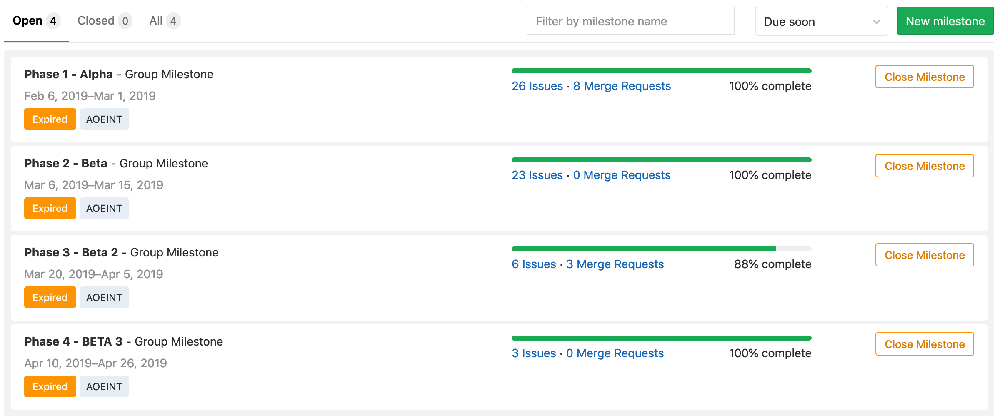
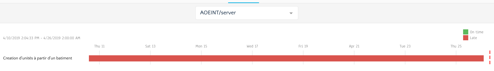

---
header-includes:
  - '`\usepackage{graphicx}`{=latex}'
---

\begin{titlepage}

\newcommand{\HRule}{\rule{\linewidth}{0.5mm}}

\center

\textsc{\LARGE Université de Strasbourg}\\[1cm]
\textsc{\Large Cursus Master Ingénierie – Informatique}\\[0.5cm]
\textsc{\large L3S6}\\[0.5cm]

\HRule \\[0.4cm]
{ \huge \bfseries rapport projet intégrateur}\\[0.4cm]
\HRule \\[1.5cm]

\begin{minipage}[t]{0.4\textwidth}
\begin{flushleft} \large
\emph{Auteur :}\\
Timothée \textsc{Oliger}\\
Adrien \textsc{Ossywa}\\
\end{flushleft}
\end{minipage}
~
\begin{minipage}[t]{0.4\textwidth}
\begin{flushright} \large
\emph{Responsable :} \\
Stephane \textsc{Cateloin}
\end{flushright}
\end{minipage}\\[1cm]

\textsc{Sujet}\\
\emph{Tiny Empire}\\[1.5cm]

\begin{minipage}{.4\textwidth}
\begin{flushleft}
\includegraphics[width=.8\linewidth]{images/unistra.png}
\end{flushleft}
\end{minipage}
~
\begin{minipage}{.4\textwidth}
\begin{flushright}
\includegraphics[width=.8\linewidth]{images/reseaux.jpg}
\end{flushright}
\end{minipage}\\[1cm]

{\large \today}

\vfill

\end{titlepage}

\tableofcontents

# Introduction

Ce projet nous permet d'appliquer les compétences que nous avons acquises durant notre licence, dans les différents domaines étudiés, notamment l'image et le réseau en CMI.
Il s'agit de créer un jeu multijoueur en temps réel, reprenant un jeux des années 1980-1990.
Il est entièrement open source les modules sont disponible sur le[git](https://git.unistra.fr/AOEINT/) le l'unistra.

# Contexte

Les CMI en option Imagerie ont été amenés à utiliser un moteur de jeu 3D, ici Unity, lors d'un projet au semestre 5.
Cette matière a permis d'approcer l'utilisation de scripts et la manipulation de l'interface de Unity. Ces connaissance préalables ont permis d'aborder plus rapidement la conception du jeu, ainsi de connaître la solutions à certains problèmes auxquels ils auraient pu faire face auparavant.
En choisissant d'utiliser Unity plutôt qu'un moteur de jeu inconnu des CMI Image du groupe, il a été posible d'avancer plus vite dans l'ensemble de la conception du jeu.

# Choix du jeu

Un premier brainstorming a été réalisé lors des réunions de début, afin de trouver le jeu le plus adapté aux demandes et contraintes du sujet.
Les avis se sont majoritairement dirigés vers un Real Time Strategy (RTS) game, soit un jeu de stratégie en temps réel.
Après reflexion, nous avons fini par choisir Age Of Empire, car cela motivait tous les membres de l'équipe, et qu'une version alégée nous paraissait accessible.
Cependant nous avons sous-estimé la charge de travail que représente un RTS tel que Age Of Empire. De ce fait nous avons du limiter énormément les fonctionnalités et nous avons
fait impasse sur la version mobile et Web.

# Conception du jeu

Plusieurs réunions de groupes ont été organisées surtout au début du semestre, afin de se décider sur les technologies à utiliser et l'arcitecture du projet à venir.
Nous avons réalisé des schémas pour prévoir au mieux une architecture robuste et cohérente avec le jeu Age Of Empire original.

## Technologies

Un des premiers problèmes rencontrés a été l'hétérogénéité entre les compétences techniques des différents membres du groupe.
Nous avons du faire des compromis pour que tous le monde puisse progresser dans de bonne conditions, et que les peronnes avançant plus rapidement puisse opérer sur un nombre plus important de tâches.

### Langage de programmation

Pour l'instance de jeu, nous avons hésité entre JAVA, Python et GO.
JAVA étant lourd et en voie d'extinction, Pyhton et GO étaient les deux choix restants.
Après discussion GO nous a paru plus adapté, dans le sens où il ressemble fortement au C et possède les avantages suivant:
- d'être compilable
- d'intégrer des outils de test
- d'intégrer une gestion des dépendances
- d'intégrer une documentation
- de très bien s'intégrer à une architecture micro-service

## Architecture

En discutant entre membres de l'équipe, nous nous sommes tournés vers une architecture de type "microservices" : c'est celle qui nous a semblé la plus propice à l'application des connaissances respectives de chacun.

## Comunication en temps réel avec GRPC

Pour la communication temps réel entre le client et l'instance de jeux nous devons utiliser quelque chose de solide qui permet de jouer en temps réel.
La deuxième contrainte et d'utiliser un protocole qui s'adapte à un environnement cloud sans ajouter une quantité non négligeable de code.

Cette librairie permet d'établir une communication stable reposant sur les standards HTTP/2.
Cette technologie a été retenue car elle peut être utilisée pour plusieurs langages de développement.
De plus, elle est facilement intégrable au code source.
Plusieurs services peuvent être implémentés et générer dans le langage cible voulu à partir d'un fichier .proto.
Ces services doivent être décrits dans ce fichier pour être ensuite interprétés par le compilateur ProtoBuf.
Un code va être généré à l'aide de ce fichier contenant l'équivalence des services spécifiés écrits en langage cible.
Ainsi, les fonctions créées permettent de récupérer/envoyer des informations de manière transparente lors du développement du jeu.
Le fichier .proto doit être le même pour code GRPC Go et GRPC C#.
Ainsi, les services doivent être formalisés de manière générique pour les 2 langages.
Les modifications de ce fichier impliquent qu'une nouvelle compilation des fichiers GRPC dans tous les langages cibles du projet.

Dans le dossier utilisé pour Unity, il faut insérer dans "Assets/Plugin", les éléments du Framework GRPC.
Ceux-ci vont permettre d'interpréter les services écrits dans le langage cible issu du fichier .proto.

### Microservices

Les avantages d'une architecture de type microservices sont :

- l'indépendance entre les services
- la quantité de code raisonnable et facilement assimilable contenue dans chaque service
- la possibilité d'augmenter la robustesse de l'application en dupliquant uniquement les services les plus sollicités.

### API authentification

Nous avons décidé de choisir la réalistion d'une API GraphQL afin de se connecter/enregister et obtenir la liste des serveurs disponibles.

#### GraphQL

GraphQL est un language créé par Facebook.
Même si REST (Representational State Tranfer) demeure le format standart des API, certains développeurs décident de se tourner vers GraphQL pour combler leslacunes majeures de ce format.
Contrairement à REST, et son modèle relativement structuré basé sur les ressources, GraphQL intervient avec une approche plus flexible : on crée un schéma de requête, puis le serveur l'analyse et renvoie les informations demandées.
De plus, l'utilisation du projet "Apollo Server" permet de monter une API GraphQL très simplement et rapidement.

#### Knex / bookshelf

Nous avons choisi d'utiliser un Object-Relational Mapping (ORM) pour la base de données contenant les informations sur les partie et les joueurs.
Ce type de programme se place en interface entre un programme applicatif et une base de données relationnelle pour simuler une base de données orientée objet.
De manière imagée, un ORM peut être décrit comme une couche d'abstraction entre le "monde objet" et "monde relationnel".

### API de classement

Ce Service permet de calculer le niveaux de chaque joueur, il exploite pour cela les résulats des parties.

#### Ligues

Le système de classement classe les joueurs dans 4 ligues différentes. Le joueur commence dans la ligue la plus basse, et lorsqu'il gagne des parties, il monte doucement le classement jusqu'à terminer dans la ligue qu'il lui correspond.
Cette API n'a pas encore développer car elle est d'une priorité basse.

#### Avantages

L'avantage de ce système de classement et que le niveau de chaque partie correspond au niveau des joueurs.
Cela permet d'améliorer l'expérience de jeu grace à un système équilibré.

#### Avancement

A l'heure actuelle, nous l'avons pas pu l'implementer car c'est un module non necessaire au déroulement de la partie qui est la priorité.

### API de gestion des parties

Ce service permet de rejoindre des partie, obtenir des informations sur les parties comme la composition des équipes.
Cela permet à une instance de partie de savoir si les joueurs qui souhaitent intéragir avec la partie appartiennent bien à la partie.
A terme cette API pourra créer à la volée des instances de partie.
A l'heure actuelle cette API n'est pas terminée mais elle devrait aparaitre en fin de semaine.

### Instance de partie

Les instances de partie sont écritent en GO et conteneuriser comme les autres services grace à docker.
Cela permetra à terme de générer une partie à la demande et de la supprimer facilement.

### Client

#### Moteur de jeu

Concernant le client, nous hésitions en Godot et unity.
Nous avons fait des tests durant 1 semaine pour pouvoir choisir le plus adapter.

##### Unity

Unity est un moteur de jeux propriétaire possédant un nombre conséquent d'assets et de fonctionnalités puissantes permetant de construire un jeux avec des outils performants.
L'avantage de Unity comparé à Godot, est que nous avon appris à le manipuler lors de l'UE "Moteur de Jeux 3D" ce qui a été décisif sur notre choix en plus du grand nombre d'utilisateurs.
A la vue de l'ampleur de notre projet, nous ne pouvions pas nous permettre de perdre un temps considérable sur la prise en main de Godot.

##### Godot

Godot est un moteur de jeux open source, il est léger et facilement intégrable avec git.
Cependant Godot souffre d'un manque cruel de communauté comparé à Unity et la documentation présentait des lacunes.
Pour départager un vote a été réalisé et notre choix s'est dirigé vers unity.

##### Choix final

Les personnes ayant testé Godot ont exprimés leurs réticences, elles étaient notament leurs expérience sur unity, la puissance d'unity et de sa grande librairie d'assets et le manque de motivation pour apprendre Godot.

# Organisation

Pour créer le jeux dans les meilleures conditions, il a fallu diviser le projet en plusieurs modules.
Pour rendre ce projet réalisable, nous avons décidé de rendre obligatoire l'utlisation du multijoueur.
Cette contrainte compliqua le dévelopement car il a fallu synchroniser le dévelopement du client et du serveur.
Cela dit, nous avons pu nous tourner vers un modèle de dévelopement itératif en intégrant au fur et à mesure les nouvelles features.

## Formations des équipes

La formation des équipes est venue naturellement en fonction des différents CMI **Image / Réseau**.
Nous avons essayé de rendre les équipes cohérentes, par exemple pour le noyaux, nous avons choisi d'y placer les membres les plus à l'aise avec la programmation système.

### Front

L'équipe front qui est composé des CMI Image est chargé de déveloper le client car ces derniers ont appris à utiliser Unity et sont plus à l'aise dans la création de l'UI / Animations ...
Elle est composée d'Adrien, Chloé et Marie.

### Noyaux

L'équipe noyaux est chargé de développer le noyau.
Jusqu'a l'alpha, elle était composée de Arthur, Louis C et de Dorian.
Durant la beta, le noyau ayant atteint ses objectifs, il est devenu plus judicieux de renforcer l'équipe réseaux en y transférant Louis C car il est à l'aise en C#.

### Réseaux

L'équipe réseaux est chargé de faire le lien entre le client et l'instance de la partie.
Elle est également en charge du dévelopement des API.
Louis T la composait à l'alpha avec le support de Tim, puis Louis Cesar le rejoigna pour booster le developement du client.
Le framework utilisé pour établir cette communication est "GRPC" entre l'instance de jeu et le client.

## Répartition des taches

La répartition des taches se fait grâce à gitlab, les issues sont créés et attribué ou choisi par les personnes disponibles.
Ce système permet de d'attribuer des taches correspondantes aux personnes augmentant ainsi la productivité.
les bugs bloquant le developement des features en cours de dévelopement sont misent en priorité.

## Planification

Pour planifier le projet nous avons séparer le dévelopement en 4 phases.

Comme nous travaillant de façon itérative, des issues évidente ont tout d'abord était ajouter à chaque étapes, puis la création des issues s'est faite à chaques itérations pour être le plus précis, cohérent et productif possible.

Voici l'etat de la plafinication gantt à ce jour:

### Gitlab

L'utilisation de gitlab est très agréable, contrairement à github, la version gratuite contient un large pannel de fonctionnabilités.

#### Issues

Les issues nous permettent de demander des features et de déclarer qu'on travail sur une feature.
Le gros problèmes que nous avons rencontré par rapport aux issues est qu'au début du projet certaines issues se faisaient sur le long thermes ou alors d'autres issues imprévues
auxquelles on avait pas pensé sont apparues au fil de l'avancement du projet.

#### Pull request

Lorsqu'une branche est stable, c'est à dire qu'elle passe les tests de l'intégration, une Pull request est créé.
Elle est validée après un test effectué par un membre et après avoir passé tout les test de l'intégration continu.

## Discussions

Les issues sont fort pratique, hélas pour des petites question technique il est utile d'utiliser de la communication sous forme de chat qui n'est pas le cas du système
de discussion directement intégré aux issues.

### Discord

Nous avons choisi discord comme logiciel de chat. En plus d'être gratuit il permet de faire des groupes d'utilisateurs et différents salons textuel et vocaux.

## CI / CD

Pour pouvoir garantir un maximum de stabilité, à chaque publication de commit, des scripts de test sont lancé sur des runner gitlab.

### Gitlab CI

Gitlab permet grace au fichier .gitlab-ci.yaml de déclarer un pipeline qui peut tester, publier et deployer des solutions logiciels

### Webhook Gitlab

Lorsqu'il y a un évenement sur un des projet git du groupe gitlab AOEINT, un message apparait dans le salon CI du discord, cela permet de prendre connaissance d'un commit ou d'une issue.

### Mirroir Github / Docker Cloud

L'instance gitlab de l'université de possède pas de registry docker.
Dockercloud perme
Dockercloud n'est pas compatible avec gitlab, pour pouvoir profiter de la ci il a falu faire un mirroir github.

# Developement

Le fait que tout le monde ne travaillait pas sous le même OS, le developpement à posé quelques soucis en début de projet.

## S'adapter aux configurations

Il a falu faire du cas par cas afin d'installer go, unity et des dépendances sur chaques machines.

## Client

Le client est la seule partie avec laquelle l'utilisateur interagit.
Les objectif de ce module, et d'intéger un système d'authentification et le jeux.

### Unity

### GRPC

Cette librairie permet d'établir une communication stable reposant sur les standards HTTP/2. Cette technologie
a été retenu car elle peut être utilisée pour plusieurs langages de développement et est facilement intégrable au code source.
Plusieurs services peuvent être implémentés et générer dans le langage cible voulu à partir d'un fichier .proto . C'est services doivent
être décrites dans ce fichier pour être ensuite interprétés par le compilateur protoc. Un code va être généré à l'aide de ce fichier contenant
l'équivalence des services spécifiées écrits en langage cible.
Ainsi, les fonctions/classes crées permettent de récupérer/envoyer des informations de manière transparente lors du dévelopement du jeu.
Le fichier .proto doit être le même pour code grpc go et grpc C#. Ainsi les services doivent êtres formalisés de manière générique pour les 2 langages. Les modifications de ce fichier
implique qu'une nouvelle compilation des fichiers GRPC dans tous les langages cibles du projet doit être réalisé.

Dans le dossier utilisé pour Unity, il faut insérer dans le dossier  "Assets/Plugin" les éléments du Framework GRPC qui va permettre d'intérpreter les services écrits langage cible
issus du fichier .proto

### Deplacement (move to)

Le déplacement d'une unité s'effectue en plusieurs étapes et nécessite de prendre en compte les obstacles placés sur la carte du jeu tels que les batiments ou les ressources présentes.
Tout d'abord, le chemin à suivre est calculé par le serveur.
Pour celà, on crée une matrice de poids en associant chaque case à un poids correspondant au nombre d'itérations nécessaire à l'algorithme pour y accéder depuis la case de destination. Une case déjà visitée ne change pas de poids s'il est défini. Les cases contenant des obstacles sont exclues de ce calcul de poids et possèdent une valeur négative pour pouvoir mieux les distinguer des autres. On connait ainsi la taille du chemin s'il existe, la demande de déplacement étant annulée sinon. Le chemin a emprunter est ensuite calculé, un thread est créé par le serveur pour déplacer l'unité pas à pas et les clients sont notifiés du déplacement.

### UI

On a essayé pour l'UI de rester proche de l'aspect de l'original tout en restant simple à prendre en main.
On affiche en bas à gauche les ressources du joueur en bois, pierre et nourriture.
Au milieu apparait une image du type d'objet sélectionné ainsi que son nom. Lorsque l'on sélectionne plusieurs unités leur nombre est également indiqué. A droite apparait un bouton avec une maison qui permet de faire apparaitre une liste de bâtiments constructibles. Ceux ci sont grisés si les ressources sont insuffisantes pour la production.

### Authentification

Pour ne pas réinventer la roue, nous avons décidé d'utiliser une technologie normaliser qui a fait ses preuves.

#### JWT

Un JWT est composé de trois partie séparées par des points, un header qui définit qu'elle est la technologie de chiffrage, un payload contenant les informations "payload" et enfin la signature vérifiant l'intégrité du JWT dans son ensemble.

Nous avons choisi d'utiliser le JWT pour authentifier chaque communication (instance <-> API, client <-> instance, client <-> API) car c'est une authentification stateless.
C'est à dire que dès qu'il est générer, il n'y a que besoin de la clé publique pour le vérifier, cela permet d'isoler la base de donnée utilisateur augmentant ainsi la sécurité.
De plus c'est un gain significatif de performance, car une fois générer, il ne faut que une faible puissance de calcul pour vérifier l'authentification.

C'est à dire que dans le payload on rajoute un champs timeout qui n'est rien d'autre qu'un timestamp, comme le JWT est "inviolable", si le timestamp est plus ancien qu'a la date de vérification, il devient faux et ne donne plus aucuns droits, il faut alors le regénérer.

L'authentification se fait grâce à l'API d'authentification, si la connexion réussi, un jwt contenant les informations sur l'utilisateur est renvoyé puis stocké dans une variable globale.

## Docker

Pour palier à ce problème, l'utilisation de docker à permis de faciliter le dévelopement.
En effet grace aux scripts présents dans les dossiers git des modules, il est très rapidement et simplement possiblede créer des conteneurs faisant tourner les services.
Par ailleurs cela à était long et plusieurs personnes ont du passer de windows familial à windows pro car docker necessite des modules de virtualisation.

## Git

Pour developer, l'utilisation de git semblait évidente.
Il n'y a pas vraiment eut de debat entre git et svn car git est accepter et compris par tous les
membres de l'équipe.

### Branches

Pour ne pas se marcher dessus et travailler en parallèle chaque feature était déveloper sur des
branches indépendantes excepté pour l'équipe front.
En effet comme unity dispose de son propre système de colaboration contrairement à godot, il est très difficile de travailler chaqu'un de son coté puis merge.
Il en devient casiment impossible lorsque différentes branches deviennent très éloignées.
De plus pour éviter des merges non maitrisé, Nous avons du faire un compromis en travaillant directement tous ensemble sur la branche develop puis de merge les versions stables dans la branche master.

#### b -> develop

Dès qu'une feature est jugée terminé. Une pull request est ouverte pour merge les modifications.
Cela permet d'intégrer les features au fur et à mesure et d'avancer par itérations

# Deploiement

La phase de deployement conventionel peut être compliqué et demander des manipulations spécifique pour metre à jour un service.
Nous avons décidé d'intégré nos service dans un cloud privée en conteneurisant nos services dans des conteneurs.

## Kubernetes

Kubernetes est un orchestrateur de conteneur.
Grace aux api de kubernetes, il est facile d'augmenter la charge de calcul, gagner en redondance et réduire le taux de panne.
Kubernetes est aussi penser pour faciliter l'intégration continu, il est très facile de metre à jour des service sur un nombre de serveur infini.

## HA

La Haute disponibilité permet un taux de panne proche de 0.
Pour ce faire, nous augmentant le nombre de serveurs physiques, nous générons plusieurs instances de chaque service sur les différents noeuds.
Nous profitons d'un système de stockage redondant reduisant le risque de perdre des données.

## Montée en charge

A terme grace aux outils cités précédément, notre infrastructure permetra d'automatiquement ajuster le nombre de noeuds de chaque service pour répondre à des montés en charge.

# Test

Nous avons essayé d'intégrer un maximum de test unitaire pour détecter et corriger un maximum d'erreurs.
Cela nous permet de gagner du temps en s'investissant moins dans la recherche de bugs.

## Go test

L'un des avantages de go et l'outils go test, il permet de lancer très facilement nos tests unitaires.

### Data race

L'outil go test permet également de détecter les data races, nous en avons rencontrés un très grand nombre.

# Partie Personnel

## Timothée Oliger

Tout d'abord je tiens à remercier mes colaborateurs, c'est ensemble que nous avons pu terminer ce jeu.

Etant chef de projet durant ce projet, j'ai essayé de faire profiter de mon expérience pour proposer des solutions et des bonnes pratiques qui je l'espère ont améliorés la qualité du projet.
Cependant je pense que le projet n'a pas évolué de façon continu et malheuresement certaines personnes n'ont pas joués le jeu de la micro organisation.
Au lieu d'exposer leurs discussions techniques sur gitlab,  certains utilisaient les messages privées puis prenaient des initatives non consenti.
Cela à entrainé des contre-temps liés à des modifications de spécifications sans concertation et de modules inutiles, entrainant des tempêtes de bugs.
Cela peut s'expliquer par un manque de pratiques et des explications pas toujours clair, peut être aussi par un manque de temps / investissement.

Ce projet m'a apporté beaucoup d'expérience sur l'aspect social d'une gestion de projet, ma difficulté était de trouver un juste milieu entre la gestion de projet et le developement.

J'ai également pu me perfectioner en:
- déployant le système de CI / CD
- deployant les services grâce à kubernetes
- adaptater les services au cloud
- Implémenter le système d'authentification
- apporter du soutient logistique pour configurer les systèmes de l'équipe
- Conseilers les membres pour aller au plus simple et apporter des solutions techniques en utilisant des outils existants comme l'utilisation de GRPC, go, utiliser une architecture par micro services ou l'utilisation de docker pour le developement ou la production

Je citerais l'utilisation de docker-compose qui nous a permis d'avoir un environment complet pour developer en local, avec bdd, api et serveur de jeu sans avoir à installer les dépendances.

Pour conclure, globalement ce projet s'est bien dérouler mais l'hétérogénéité entre les membres à compliquer le déroulement du projet, par ailleurs je trouve que des membres se sont démenés pour finir ce projet et ont enormement progréssé dans leurs domaines.
Choisir un jeux sans connaitre les membre d'une équipe, leurs capacitées et motivations est très difficile, je pense après reflexions que nous avons choisi quelquechose de trop ambitieux.

J'ajoute que la création d'un registry gitlab serait bénéfique pour les années futures.
Cela permetrait de se limiter à gitlab pour le circuit de CI/CD (test, build, deploiement).

## Adrien OSSYWA

Ce premier projet de "grande ampleur" m'a vraiment montré à quel point la coordination est un point crucial pour le bon avancement du projet.
En effet là était le plus gros problème de mon point de vue car je me suis souvent retrouvé à coder pas mal de fonctionnalitées qui finalement n'ont pas été utilisées, mises de côtés ou alors gérées côté serveur.
Ces quelques petites erreurs sont aussi dues en partie au fait qu'il s'agit de la première fois que je développe un jeux avec une aussi grosse séparation client / serveur contrairement au jeu développé durant l'UE "Moteur de Jeux 3D".

Ma partie a été centrée sur plusieurs points :
- les fonctions de créations des différentes entitées à des positions précises.
- les pages de connexion avec l'appel à l'api
- la gestion de déplacement de toutes les entités sur la carte
- les sons

Unity m'a vraiment aidé surtout sur la partie Déplacement des entités car il existe des fonctionnalités très efficaces nativement incluses.

En ce qui concerne le choix du jeu j'étais contre un RTS (surtout Age of Empire) car ce style de jeux est très complex à prendre en main et donc encore plus à réaliser à la vue de toutes les fonctionnalités à prendre en compte.
Nous avons du limiter notre jeu au strict minimum pour avoir quelque chose de jouable ce qui à mon avis n'est pas la meilleure stratégie pour un premier projet d'une telle ampleur.
C'est pour cela que j'aurais préféré partir sur un jeu plus accessible comme "Bomberman" qui est plus facile à réaliser et à personnaliser.

Outre cela, ce projet ma tout de même appris énormément que se soit sur Unity, sur le modèle client / serveur, sur la cohésion de groupe ou alors sur d'autres choses comme l'utilisation d'une API ou sur les protocoles de communications, etc... qui m'étaient jusqu'à présent inconnus.
Je continuerais surement à améliorer ce projet par la suite pour voir jusqu'où aurions nous pu aller avec un peu plus de temps et pour avoir la satisfaction de terminer correctement ce qui à été commencé.

## Chloé Riche

Un projet avec autant de personnes impliquées à été une réelle découverte pour moi, autant sur la communication entre les personnes que sur la séparation des tâches, plus marquée que sur un plus petit projet.
Je n'avais jamais travaillé avec des protocoles de communication ou encore une équipe entièrement réseau : nous avons donc du apprendre à être clairs dans nos réunions et processus de travail, même avec des personnes qui ne connaissent pas les outils avec lesquels nous travaillons. Lorsque ce n'était pas le cas, certaines personnes se retrouvaient à coder des fonctions déjà programmées ou à utiliser des prototypes non existants par exemple.

Réaliser un projet de plus grande ampleur sur Unity m'a bien sûr permis de développer mes capacités sur ce moteur de jeu, autant en programmation C# qu'en manipulation de l'interface graphique. Je n'avais jamais eu à créer d'UI aussi importante auparavant.

S'impliquer dans la décision du jeu a été difficile pour moi, étant donné que je n'avais pas idée de la quantité de travail impliquée par les différentes propositions. Je pense que nous sommes pour la plupart d'accord sur le fait que un "Age Of Empire" - like est un pari probablement trop ambitieux pour le temps qui nous a été donné, cependant je suis quand même réjouie de voir les progrès que nous avons réalisé depuis le commencement.

Mes différentes tâches dans le jeu sont regroupées dans cette liste non exhaustive :

* implémentation de la sélection des unités, bâtiments et ressources selon les conditions respectives à appliquer (multi-selection pour les unités notamment)
* le développement de l'UX/UI via des wireframes et ensuite sur Unity
* modélisation des bâtiments sur Autodesk Maya et intégration dans Unity
* réalisation du logo du jeu
* réalisation du document de communication

J'ai tenté de mettre au maximum à profit mon expérience dans le domaine de l'image et du design graphique, afin de proposer un expérience client agréable et cohérente avec l'univers que nous avons souhaité développer.

## Monfouga Marie

Personnellement, faisant partie de l'équipe Front, ce projet m'a permis de m'améliorer dans l'utilisation d'unity et de découvrir de nouvelles fonctionnalités de ce logiciel. J'ai aussi pu découvrir ce qu'était de travailler sur un projet avec un grand groupe et des parties à réaliser bien distinctes.

Préférant me concentrer sur l'approfondissement de mes connaissances sur Unity plutôt que sur la découverte d"un nouveau logiciel, Godot, j'ai voté pour l'utilisation de celui ci.

Pendant le dévelopement je me suis principalement concentrée sur
* la disposition et le choix des éléments de l'UI ainsi que l'interaction entre l'UI et le joueur
* la vision du joueur de l'environment, c'est à dire la position de la caméra et ses déplacements par le biais du clavier ou de la souris
* le placement des bâtiments et la demande de création de Npc ainsi que la gestion des ressources
* le brouillard permettant de ne pas voir toute la carte dès le début

Mon but lors de l'implémentation de ces diverses fonctionnalités a été de les rendre les plus complètes possibles. En partant d'une idée de fonction, chercher une implémentation possible puis un maximum d'améliorations a parfois été délicat. Pour le brouillard par exemple, il m'a fallu faire des recherches sur les outils d'Unity qui me permettait de le réalier facilement. J'ai ainsi trouvé un système de grille que j'ai ensuite du prendre en main afin de l'associer correctement à notre travail existant.

La partie la plus difficile au commencement était la mise en commun de nos modifications respectives sur Unity.
Chaque changement sur la scène modifiant le fichier de la scène automatiquement il était parfois compliqué de résoudre les conflits.
Lors d'un ajout de fonctionnalité il fallait également faire attention à ne pas empiéter sur le travail des autres et à s'accorder avec l'équipe serveur.

## Louis-César Pagès

Ce projet m'a permis d'utiliser pleinement les connaissances apprises tout au long de mes études et notament lors de mon séjour ERASMUS en Espagne.
En effet, j'ai déjà eu l'opportunité de créer un projet de dévelopement dans le cadre d'une UE "Software engineering" où j'ai pû en apprendre beaucoup sur l'environnement de travail Visual Studio.
Donc, lorsque j'ai été assigné à la communication
côté client, je me suis senti très à l'aise avec le code C# généré par Unity.

Le plus compliqué fut de trouver la manière d'intégrer le framework GRPC sur Unity.
En effet, une documentation existe pour le dévelopement avec C# mais pour Unity cela reste experimental.
J'ai dû dans un premier temps me documenter sur cette intégration notamment en cherchant des exemples de projets/programmes Unity fonctionnant avec GRPC.
Timothée m'a aidé à trouver la commande pour générer à partir d'un fichier .proto le code GRPC en C#.
A partir de là, il fallait insérer la librairie dans le dossier plugin du programme Unity.

Le développement au fur et à mesure de la communication s'est faite sans grande difficulté.
Il a fallut s'adapter au formalisme imposé par le grpc.
Une première approche a été d'établir
les structures de données échangées entre le serveur et le client.
Avec Louis Thommann, nous nous sommes donc mis d'accord dès le début pour définir ces spécifications.
Le fichier .proto devant être unique (Les structures de données et fonctionnalités doivent être les mêmes côté client et serveur), chaque nécessité de modifier ce fichier faisait l'objet d'une concertation entre nous deux.

Mon travail a aussi été étrois avec les personnes en charges du client.
En effet, comme étant l'intermédiaire entre le serveur et eux, mon rôle devait être d'implémenter leurs besoins par rapport au serveur (par exemple: Obtenir les resources actualisés d'un joueur, charger des éléments demandés par le serveur) , mais aussi de faire de la pédagogie en expliquant les limites des communications pouvant être établis et les besoins du serveur (exemple: envois des déplacements de npc, Zone et actions non autorisés par le serveur).
Ce rôle d'intermediaire a été très enrichissant d'un point de vu technique, j'ai pû avoir un pied dans le côté client et un autre dans celui du serveur.
Une position central dans la communication que je trouve très intéressant.

## Dorian SCHWAMBACH

### Choix du jeu

Personnellement même si j'adore ce jeu, je n'étais pas totalement pour le choix de ce jeu en raison de sa complexité à mettre en oeuvre pour le premier gros projet que j'ai pu faire.

### Choix du langage

Faisant parti de l'équipe serveur, ce projet m'a permis d'apprendre un nouveau langage qui est Golang.
Arthur, louis-césar et moi-même avons d'abord voulu utiliser java car nous avons eu des cours utilisant ce langage.
Timothée nous a proposer d'utiliser le langage Golang à la place. Après réflexion, nous avons finalement opté pour Golang en raison des différents avantages qu'il comportant par rapport à java tel que la performance, le parallélisme, l'intégration avec Git, la communication avec le client et les tests unitaires.
L'apprentissage du langage m'a pris un peu de temps, néanmoins le langage ayant des similitudes avec C, l'apprentissage a été simplifié.

### Domaine de travail

Mon travail s'est principalement porté sur la récolte de ressources, la gestion de l'attaque et les actions de déplacement des PNJ.
Ce qui m'a prit le plus de temps fut de corriger les nombreuses data-race qu'ont engendrer ces différentes actions, notamment l'interaction entre ces différentes actions.
Pour les identifier, les tests de Golang ainsi que la CI mise en place sur Git m'ont été utiles

### Communication

Globalement, la communication fût bonne, je n'ai pas eu de problème pour joindre une personne ou le groupe.
Les réunions hebdomadaires ont été très utiles afin d'être au point sur notre avancement et de pouvoir bien fixer les fonctionnalités à produire et éviter que chacun travaille de son côté sans être informé de ce que réalisent les autres et des besoins urgents pour le projet.
Néanmoins, il y a eu parfois quelques soucis de communication sur les fonctionnalités à produire.
Par exemple, on m'avait dit de réaliser une récolte de ressource automatique alors que finalement il était plus important d'abord d'avoir une récolte de ressource s'effectuant par ciblage.
J'ai pour ma part surtout communiqué Arthur qui a su être très réactif si j'avais des commentaires ou des questions sur le projet que ce soit technique ou théorique.

En bref, grâce à ce projet, j'ai pu apprendre un nouveau langage ainsi qu'en apprendre plus sur la réalisation concrète d'un "gros" projet et mettre en pratique mes connaissances acquises lors de la licence

## Louis THOMANN

J'ai fait partie de l'équipe réseau dès son début pour gérer les communications entre le client et le serveur.
J'ai été très heureux de travailler avec la technologie GRPC.
De plus d'être très polyvalente, son utilisation est extrêmement naturelle avec Go.
On ne se rend pas compte qu'on communique avec un serveur/client distant.

J'ai beaucoup apprécié la venue de Louis-César dans l'équipe réseau au mois de mars.
J'avais pu commencer le développement des fonctions de réponse du serveur, mais le moment de les tester, ce fut la surprise.
Le C# mettant totalement inconnue, et la compilation du .proto en C# n'étant pas aussi simple qu'en Go, Louis-César nous fut un excellent atout.
Il a su, avec l'aide de Timothée, comment convertir le .proto de sorte à l'utiliser avec Unity.
Nous avons beaucoup travaillé ensemble, de sorte à établir un bon protocole de communication.

Une autre personne avec qui j'ai beaucoup travaillé est Arthur.
C'était mon référent côté serveur, il m'aida beaucoup pour remplir les premiers services GRPC.
Sachant tout ce qui se développait sur le serveur, son aide fut crucial pour comprendre tout ce qui avait été fait et savoir comment l'utiliser.

J'ai pu, lors de ce projet, apprendre le langage Go.
Ce langage est tellement proche du C, mais avec un peu de re-nouveau qui est très appréciable.
J'ai aussi eu l'occasion d'améliorer ma maitrise de Git.
En plus de voir son utilisation dans un groupe assez important, j'ai pu comprendre mieux l'importance du Git Flow, de la clarté d'un commit et des autres commandes existantes.

Je conclurais en disant que le plus grand défi de ce projet, en plus d'arriver à finir ce jeu très ambitieux dans les temps, était de bien s'organiser.
On peut penser que 2-3 personnes par équipes fonctionnelles dans un projet à 8 c'est peu.
Mais cela demande déjà une organisation et une logistique impossible à négliger.
Nous avons pu compter sur le regard de Timothée pour nous proposer des technologies intéressantes.
Il a aussi réalisé des tests d'intégration continue qui ont aussi été un grand défi lors des "Milestone".
Ce projet laisse un souvenir indélébile d'une première expérience de développement dans une équipe.

# Conclusion

Ce projet nous a permis d'appliquer la théorie enseignée ainsi que d'apprendre divers facette du developement.
Nous tenons à remercier Stephane Cateloin qui a su nous guidé et nous accompagné pour mener à bien ce projet et de nous avoir diriger vers un produit réalisable.
Nous allons continuer ce projet jusqu'a avoir une version très stable et publiable.
