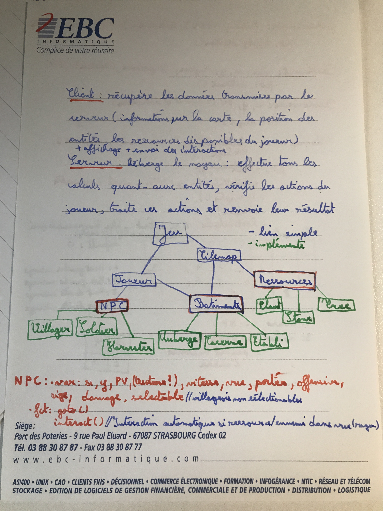
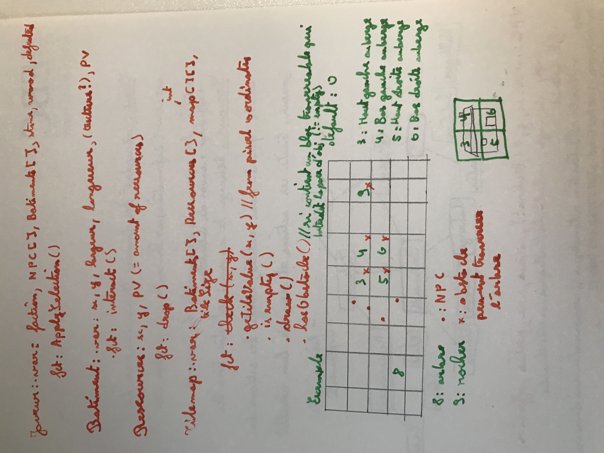

# Compte rendu

# Carte

Le jeu se déroule sur une carte.
La carte est représentée à l’aide d’une matrice 512*512. L’origine se situe en HAUT à gauche (x:0,y:0).
Chaque cellule de la matrice est « utilisée » ou non, sois il y a un élément dessus : bâtiments, ressources, cases définies ; sois elle est vide et on peut construire dessus. Le temps d’une partie ne peut pas excéder 15minutes de jeu.

## Camps

Les équipes (bases) sont composés de camps.
Un joueur contrôle un camps.
Chaque camps possède une auberge placée au coins  de la carte.

## ressources

Sur la carte est disposée des éléments, eau, arbres, roche.
Les joueurs disposent de ressources.
Ils peuvent récupérer plus de ressources à partir des éléments sur la carte:  bois, pierre, nourriture. On peut créer différents bâtiments à l’aide des ressources : établi avec du bois, caserne avec du bois et de la pierre.

## Batiments
Chaque bâtiment possède un fonction propre : l’établi créer des « Harversters » pour récupérer de la pierre, la caserne créer des soldats.
La fabrication des bâtiments a un coût  et nécessite du temps. Les bâtiments ont une barre de vie.

## Spécification
*  Une instance représente une partie, composée : → d’un UUID → d’un nom → de joueurs : (UUID,nom ); → entités (fct moveto() )
* La carte est définie en JSON a
  * une taille (tableau, 2D)  [[équipe, type, PV ……. (autre élément)]]
    * Bâtiments :
      * type : int
      * pv : int
      * propriétaire : uuid

